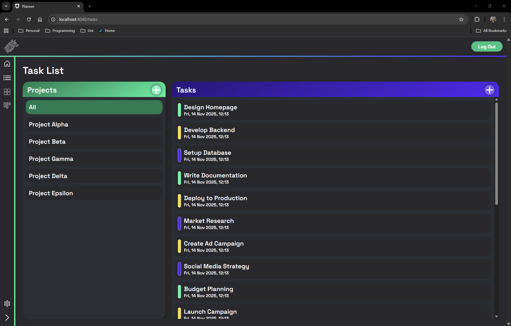
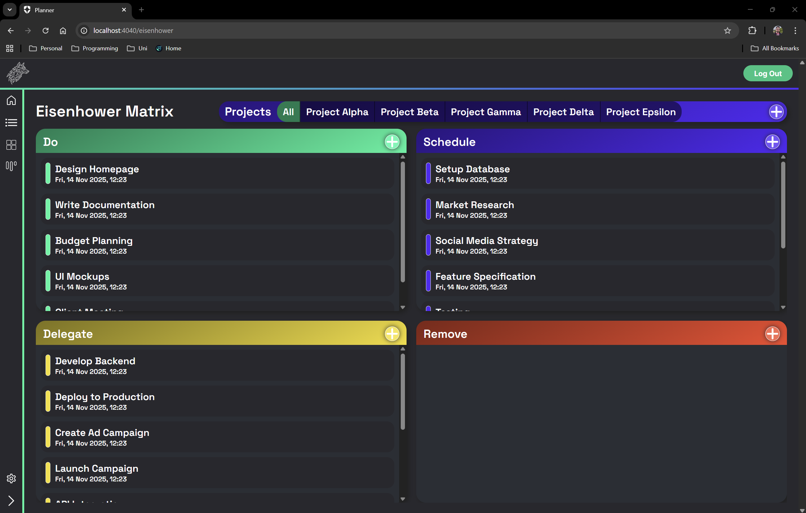
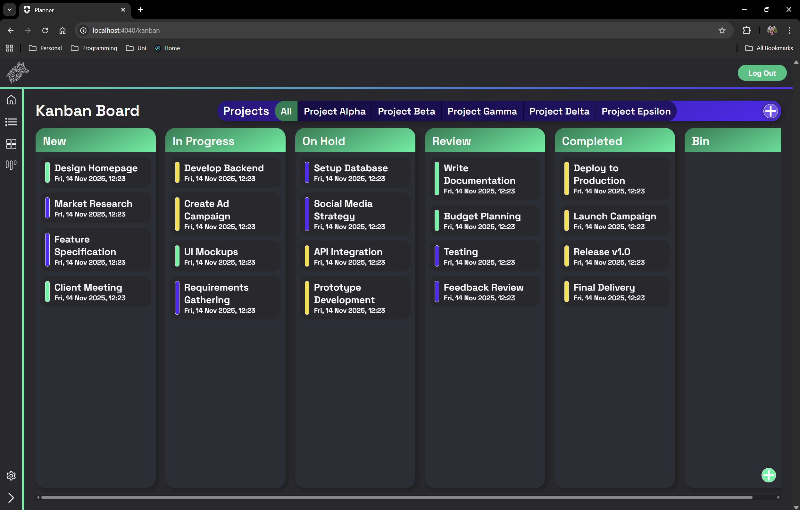
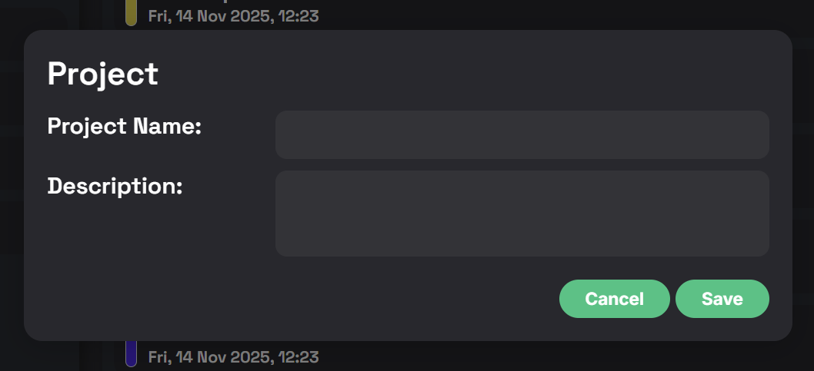
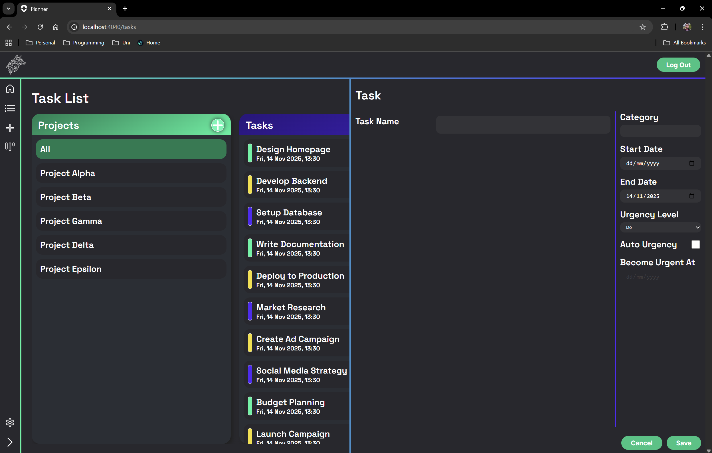

# Planner (WIP)
*last updated: 14-11-25*

## About

This is a simple planner application designed in **React** to manage tasks across multiple projects and people. Some of the features I'm working on:-

* **Data structure** - People often have multiple tasks across multiple projects. Projects will encompass a set of tasks that will each have a set of sub tasks.
* **Multiple displays** - Whatever your preferred way of working is - a task list, Eisenhower matrix, Kanban - you should be able to see and manage task in a way that suits you.
* **Filtering data** - Tasks will be assigned to people, projects and categories. Whatever you're looking for should be easy to find and you should be able to filter tasks to find them faster.
* **Multiple users** - Users will be able to login and share projects and tasks with other people. Authentication is being handled via Auth0, see [Auth0 Developer Resources](https://developer.auth0.com/resources) for more info.
* **Detailed task info** - When creating tasks, it should be possible to add different types of info: text, checklist, other tasks.
* **Statistics** - There's a lot of data in a task list, doing some simple data science we should be able to see at a glance what projects are running on time, where tasks are overdue and how close a project or task with sub-tasks is to completion.

Note:- This is a personal project done in my spare time to improve my skills and just see what I can do.

## API

The API for this is being developed in a separate repository and can be found in my [Planner API Repo](https://github.com/Jcfleming88/Planner_API)

## Progress So Far

### Multiple Displays

#### Task List
The basic task list gives plenty of space to see your tasks. Useful for if we want to display more data on the page. It may be useful down the line to increase the level of detail on projects and tasks here.

#### Eisenhower Matrix
The idea of an Eisenhower Matrix is that urgent things are on the left of the matrix and important things are on the top row. Typically, you should **Do** the things in the top left, **Schedule** the things in the top right, **Delegate** the less important but urgent things on the bottom left and **Remove** the not important, not urgent things in the bottom right by any means!

This is my preferred way of managing my day to day tasks as I find ToDo lists a bit more restrictive and unfocused. It's also useful to move tasks around depending on what you think is important and urgent as priorities change.

#### Kanban
Used extensively across projects to manage teams and run sprints. Being able to check tasks and move them through a check/review process helps to keep teams on task and on time.

### Data Structure

#### Projects

Keeping the projects simple to start with, I've added the ability to create new projects with a name and description. Later on, I'll look to add the ability to assign other people to a project and manage user stories.

#### Tasks

Starting with the base info, I've created a pull-out window where you can input all the key information about a task. This will allow me to move onto creating a database where this information can be added and in the space below the 'Task Name' I'll be able to build out the detailed task information.

